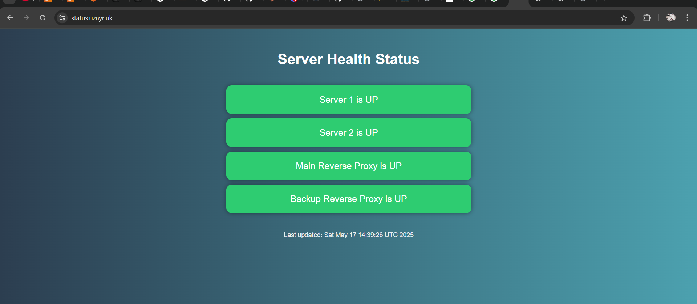

High availability web server with NGINX and SSL

# Project Objective

**Networking Assignment v2** aims to build a highly available web setup using multiple backend servers, an NGINX reverse proxy, and SSL encryption.

Key goals:

- Set up domain and DNS with two subdomains: one for the app (`app.yourdomain.com`) and one for a status page (`status.yourdomain.com`).
- Deploy two backend VMs with simple web apps and a third VM as an NGINX reverse proxy/load balancer.
- Secure the app with SSL (using Let’s Encrypt) and enforce HTTPS.
- Create a status page showing backend health and active server.
- Optional: Make the reverse proxy highly available with failover.

**Outcomes:** Learn reverse proxy setup, SSL implementation, health checks, and cloud resilience.  

# Servers

We began by creating 5 ec2 instances, 2 will be our backend servers and 2 will be our reverse proxy load balancers(one main and one backup) and one will be the status page, and using user data we configure nginx with this script 
- user data script
```#!/bin/bash
sudo yum update -y
sudo yum install nginx -y
sudo systemctl enable nginx
sudo systemctl start nginx
```

- for the security group we allow http, https, ssh 
- for the 2nd web server go to /usr/share/nginx/html/index.html and change the file contents so the web pages are different


# Reverse Proxy and Load balancer configuration

- in the main and backend we need to edit the /etc/nginx/nginx.conf
- for the load balancer we create an upstream block and add private IP's of our backend servers
``` upstream 'name of server' {
    server **private IP 1**;
    server **private IP 2**;
}
```
this will distribute traffic across the 2 backend servers

- Then we configure the reverse proxy section, for this we add
``` location / {
    proxy_pass http://'name of server'(name we use for upstream block);
}
```
- we do this in both reverse proxy servers, and we add them both within the server block

- then we test whether it works by creating an A record and pointing it to the public IP of the main reverse proxy. by refreshing we should get access to both pages

# Status page

- For this page we need to create a script which will write to a `.html` file 
- We will edit the /etc/nginx/nginx.conf and add an index under root in the server block. The index will be the name of the file we will output to
- For the script we use Curl to confirm whether the servers are active or are down
```#!/bin/bash
nginx1="172.31.88.200"
nginx2="172.31.95.109"
proxy1="172.31.87.160 "
proxy2="172.31.85.228"
while true; do
if [ $(curl -Is $nginx1 | head -n 1 | awk '{print $2}') -eq 200 ]; then
echo "server 1 is up and running"
else
echo "server 1 is down"
fi
if [ $(curl -Is $nginx2 | head -n 1 | awk '{print $2}') -eq 200 ]; then
echo "server 2 is up and running"
else
echo "server 2 is down"
fi
if [ $(curl -Is $proxy1 | head -n 1 | awk '{print $2}') -eq 200 ]; then
echo "main reverse proxy is up and running"
else
echo "main reverse proxy is down"
fi
if [ $(curl -Is $proxy2 | head -n 1 | awk '{print $2}') -eq 200 ]; then
echo "back-up reverse proxy is up and running"
else
echo "back-up reverse proxy is down"
fi
sleep 5
done
```
- we then change it into .html format and output it to a .html file
- to test it we first have to make it executable `chmod +x /path/to/script`


# Continuous monitoring of server health

- For our script to run continuously we have to create a cronjob
- first we install cron `sudo yum install cronie`
- then we enable and start it ` sudo systemctl enable crond``sudo systemctl start crond`
- To create our cron job we do `crontab -e` and then we add `* * * * * /path/to/script`
- the `* * * * *` means it will run every minute of every hour of every day of every week of every weekday
- our status page will be continuously monitoring our backend and reverse proxy servers


